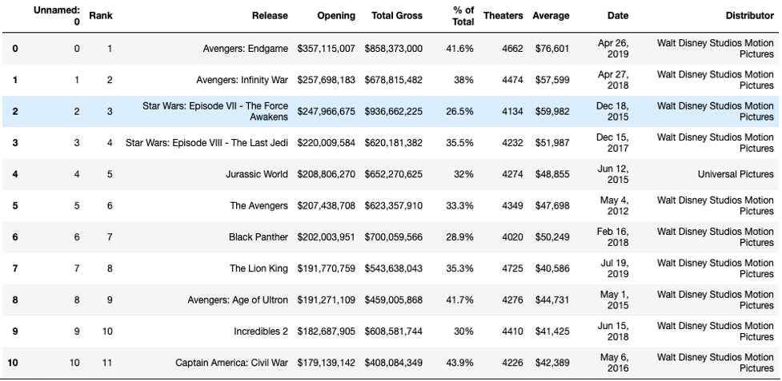
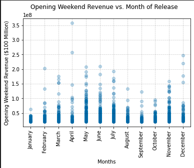
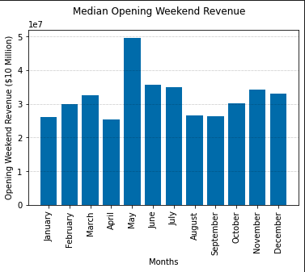
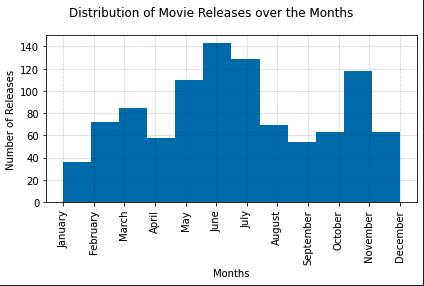
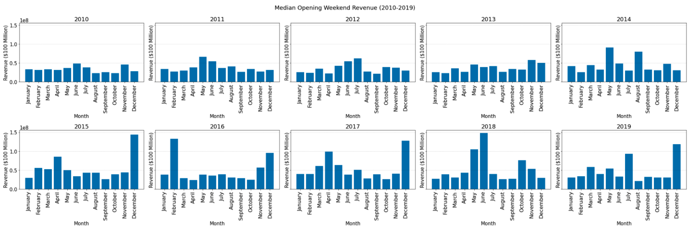
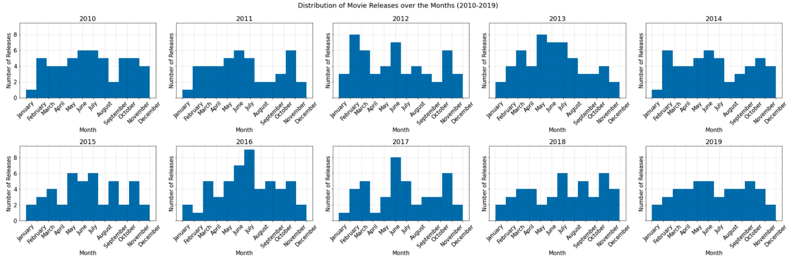
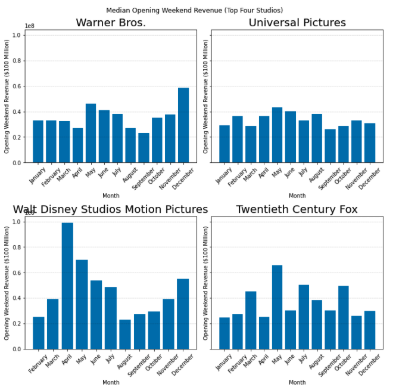
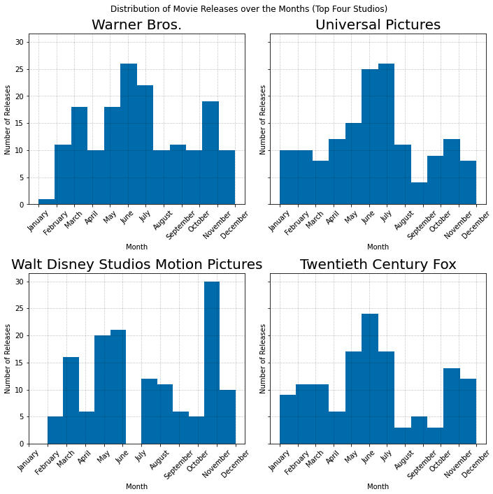

# Opening Weekend at the Box Office:
### An Exploratory Data Analysis of Box Office Revenue
  

  
# Background & Motivation
At the fundamental level, films are investments for production companies. Every decision these companies make when preparing for a release is a strategic effort to maximize profits, including WHEN they decide to release movies. In my data analysis, I sought to find out which months have the highest opening weekend revenue.

# Questions
<ul>
	<li>Which months usually have the highest opening weekend revenue?</li>
	<li>In which months are movies released more frequently?</li>
	<li>Were the trends the same from 2010 to 2019?</li>
	<li>Are the trends the same for the four most represented distributors in the dataset? (Warner Bros., Universal Pictures, Walt Disney Studios Motion Pictures, and Twentieth Century Fox)</li>
</ul>

# Data
I collected my data from Box Office Mojo, which is a database managed by IMDB that contains box office information for different movies. I specifically used their table containing the Top 1000 Opening Weekend Box Office Revenues.1 Scraping the data on 15 November 2021, using a <a href="src/create_csv.py">Python script</a> resulted in the table below:
  

## <u>Summary of the Data:</u>
1000 Rows, each containing the following information for one unique movie:
<ul>
	<li>Rank: Ranking of Movie based on Opening Weekend Revenue (Numerical)</li>
	<li>Release: Title of the Movie (Categorical)</li>
	<li>Opening: Opening Weekend Revenue (Numerical)</li>
	<li>Total Gross: Total Gross of the Film (Numerical)</li>
	<li>% of Total: Opening Weekend Revenue as a percentage of the Total Gross (Numerical)</li>
	<li>Theaters: # of Theaters the Film Released in (Numerical)</li>
	<li>Average: Average Opening Weekend Revenue Per Theater (Numerical)</li>
	<li>Date: Date of Release (Categorical)</li>
	<li>Distributor: Distributor of the Film (Categorical)</li>
</ul>

## <u>Cleaning:</u>
<ul>
	<li>For the purposes of my research, I decided I only needed to use the “Release”, “Opening”, “Date” and “Distributor” columns of the table</li>
	<li>Upon inspection of my data, I noticed that the films “Scary Movie 4”, “Halloween”, and “1408” were missing entries in the “Distributor” column. Through research, I found out that the Weinstein Company Distributed each of these films, so I replaced each null value with “The Weinstein Company”.</li>
	<li>I modified the “Opening” column so that it contains integers instead of strings and the “Date” column so that each date became a DateTime object.</li>
	<li>I also created “Month” and “Year” columns based on the month and year a film released.</li>
</ul>

# Visualization
## Part 1: Analyzing the Entire Dataset
I first wanted to see the general distribution of my dataset, so I decided to create a scatter plot of the Opening Weekend Revenue vs Month of Release.
  

  
Observing the data, there are two peaks in opening weekend revenue, the first around May and the second around November. To get a better idea of which month typically has the highest revenue and to also ignore outliers, I decided to look at the median revenue for each month.
  

  
As depicted in the graph, the movies in my dataset that were released in May, June, July and November typically made the most money in their opening weekend. I assumed that studios probably use this historical trend when choosing release months, so I decided to see which release months are most common in the dataset.
  
  

##### (L: Table of Months and Associated # of Releases, R: Distribution of Movie Releases over the Months)
  
As shown, June, July, November and May are the most common release months for films, aligning with the trend I predicted.
  

## Part 2: Splitting the Data up by Year
To continue my analysis of this trend, I looked at data from the years 2010-2019 to see if the pattern was consistent for that decade.
  

  
In most of the years represented, there are noticeable peaks in revenue in the summer months and the late fall/early winter months. I then looked the distribution of the release months.
  

  
In most years, more movies also released during the summer and late fall/early winter months.
  

## Part 3: Top Four Studios
I repeated the steps in Part 2, but instead looked at the Top Four Studios represented in my dataset: Warner Bros., Universal Pictures, Walt Disney Studios Motion Pictures, and Twentieth Century Fox. This resulted in the following bargraph and histogram:
  

  
The trends that were observed during the previous steps of analysis remained consistent during this step.
  

# Conclusions
Based on my analysis, movies released during the summer months and the late fall/early winter months tend to perform the best. Studios also seem to release more movies during these times. These trends show that studios are avoiding “Dump Months”. These months, including January and February, traditionally carry lower critical and commercial expectations than other months of the year. Studios often fill these months with movies that performed poorly for test audiences to fill contractual obligations.2 Meanwhile, the summer and early winter are good times to release films because kids and young adults are typically out of school in the United States. Studios also have a long history of saving their best films for the end of the calendar year, just in time for award season.3

## <u>Future Research:</u>
<ul>
<li>While my dataset follows accepted trends in the movie industry, it is very limited in scope. For instance, it only examines the 1000 movies that had record-breaking opening weekends. It would be more accurate to conduct on a wider range of films that weren’t necessarily this successful to see how a more standard films perform month to month.4</li>
<li>It would also be interesting to see how these trends vary from country to country. In my research, I read that January is starting to be a more successful month for movies in China, seeing far more domestic releases during the month.5</li>
<li>These trends are also more representative of the time before the COVID-19 Pandemic, so in the coming years, further studies could be conducted to see if these trends change.</li>
</ul>

# Works Cited
<ol>
<li>https://www.boxofficemojo.com/chart/top_opening_weekend/</li>
<li>https://www.theatlantic.com/entertainment/archive/2012/01/january-dumping-ground-for-terrible-movies-like-contraband/251326/</li>
<li>https://web.archive.org/web/20140104114025/http://www.nytimes.com/2013/01/20/magazine/how-to-survive-januarys-dearth-of-good-movies.html</li>
<li>https://web.archive.org/web/20140104114025/http://www.nytimes.com/2013/01/20/magazine/how-to-survive-januarys-dearth-of-good-movies.html</li>
<li>https://www.latimes.com/business/hollywood/la-fi-ct-china-box-office-new-year-20180222-story.html</li>
<li>https://www.google.com/url?sa=i&url=https%3A%2F%2Ftenor.com%2Fsearch%2Fgoing-to-the-movies-gifs&psig=AOvVaw05C5Ci5GLZ1tsggiBGp-Wd&ust=1637850261584000&source=images&cd=vfe&ved=0CAwQjhxqFwoTCMjs0-qZsfQCFQAAAAAdAAAAABAJ</li>
</ol>

